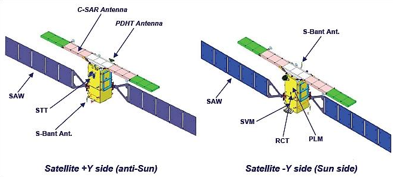
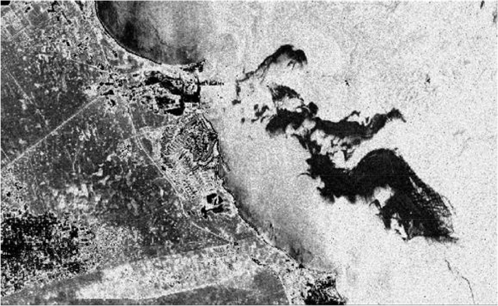
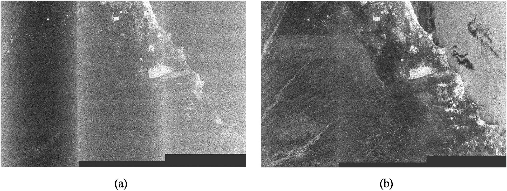

##WHAT?
- Sentinel-1 is the first of the five missions that European Space Agency(ESA) is developing for the Copernicus initiative
- providing an all-weather, day-and-night supply of images of Earth’s surface 
- Composed of a constellation of two satellites, Sentinel-1A and Sentinel-1B, sharing the same orbital plane
- A single SENTINEL-1 satellite will be able to map the entire world once every 12 days. The two-satellite constellation offers a 6 day exact repeat cycle.
```{r echo=FALSE, out.width = "60%", fig.align='center', cache=FALSE, fig.cap="(Source: ESA)"}

knitr::include_graphics('data/sentinel_1.jpg')

```
---
.pull-left[##SAR 
- SENTINEL-1 carries a single C-band synthetic aperture radar instrument operating at a centre frequency of 5.405 GHz
- Synthetic Aperture Radar (SAR) offers the advantage of operating at wavelengths unaffected by cloud cover or insufficient illumination, allowing data acquisition over a location during both day and night, irrespective of weather conditions]
.pull-right[##Spatial resolution
Four modes
```{r echo=FALSE}
a <- read.csv('data/1.csv')
knitr::kable(a, format = 'html')
```
]
```{r echo=FALSE, out.width = "60%", fig.align='center', cache=FALSE, fig.cap="(Source: ESA)"}

```
---
##Application
Main applications include:
 - Monitoring sea ice and icebergs 
 - monitoring of land ice (glaciers, ice sheets, ice caps) 
 - river and lake ice monitoring 
 - oil spills and ships 
 - marine winds & waves 
 - land-use change, agriculture, deforestation
 - land deformation 
 - support to emergency management such as floods and earthquakes
 
---
###An assessment of oil spill detection using Sentinel 1 SAR-C images(Akinwumiju, Adelodun and Ogundeji, 2020)
The paper studies an oil spill occurred in the Al Khafji region by applying sentinel 1 SAR-C images.
When radar signals are transmitted to the ocean, oil spills can be identified due to the dampening effect of oil on surface waves.This article compares VV polarization and VH polarization(two methods to identify oil spills), concluding that VV polarization is more suitable for identifying oil spills.
.pull-left[
```{r echo=FALSE, fig.align='center', fig.cap="(Source: Chaturvedi, Banerjee and Lele, 2020)", cache=FALSE, out.width="100%"}


```
]
.pull-right[
```{r echo=FALSE, fig.align='center', fig.cap="(a)VH and (b)VV", cache=FALSE, out.width="100%"}

```
]
---
##Reflection
- Unlike Landsat carrying multi-spectral sensors that Multi-spectral sensors capture spectral information by detecting electromagnetic radiation in the visible and infrared bands to capture the reflected or emitted radiation from the Earth's surface, Sentinel-1 carries SAR which is an active sensor that do not rely on reflected sunlight
- As Sentinel-1 moves, SAR can record the echoes of Sentinel-1 at different positions and merge them to form higher-resolution images.
- SAR offers the advantage of operating at wavelengths unaffected by cloud cover or insufficient illumination, allowing data acquisition over a location during both day and night, irrespective of weather conditions
---
##References
Chaturvedi, S.K., Banerjee, S., Lele, S., 2020. An assessment of oil spill detection using Sentinel 1 SAR-C images. Journal of Ocean Engineering and Science 5, 116–135. https://doi.org/10.1016/j.joes.2019.09.004

*Sentinel-1 - Missions - Sentinel Online - Sentinel Online* (no date). Available at: https://sentinels.copernicus.eu/web/sentinel/missions/sentinel-1 (Accessed: 17 February 2024).

